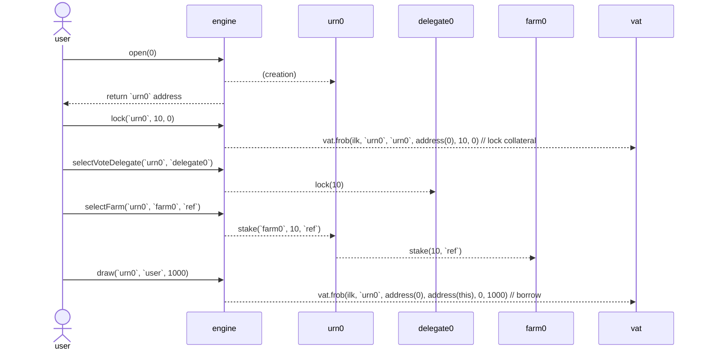

# Lockstake Engine

A technical description of the components of the LockStake Engine (LSE).

## 1. LockstakeEngine

The LockstakeEngine is the main contract in the set of contracts that implement and support the LSE. On a high level, it supports locking MKR in the contract, and using it to:
* Vote through a delegate contract.
* Farm NST or SDAO tokens.
* Borrow NST through a vault.

When withdrawing back the MKR the user has to pay an exit fee.

There is also support for locking and freeing NGT instead of MKR.

**System Attributes:**

* A single user address can open multiple positions (each denoted as `urn`).
* Each `urn` relates to zero or one chosen delegate contract, zero or one chosen farm, and one vault.
* MKR cannot be moved outside of an `urn` or between `urn`s without paying the exit fee.
* At any time the `urn`'s entire locked MKR amount is either staked or not, and is either delegated or not.
* Staking rewards are not part of the collateral, and are still claimable after freeing from the engine, changing a farm or being liquidated.
* The entire locked MKR amount is also credited as collateral for the user. However, the user itself decides if and how much NST to borrow, and should be aware of liquidation risk.
* A user can delegate control of an `urn` that it controls to another EOA/contract. This is helpful for supporting manager-type contracts that can be built on top of the engine.
* Once a vault goes into liquidation, its MKR is undelegated and unstaked. It and can only be re-delegated or re-staked once there are no more auctions for it.

**User Functions:**

* `open(uint256 index)` - Create a new `urn` for the sender. The `index` parameter specifies how many `urn`s have been created so far by the user (should be 0 for the first call). It is used to avoid race conditions.
* `hope(address urn, address usr)` - Allow `usr` to also manage the sender's controlled `urn`.
* `nope(address urn, address usr)` - Disallow `usr` from managing the sender's controlled `urn`.
* `lock(address urn, uint256 wad, uint16 ref)` - Deposit `wad` amount of MKR into the `urn`. This also delegates the MKR to the chosen delegate (if such exists) and stakes it to the chosen farm (if such exists) using the `ref` code.
* `lockNgt(address urn, uint256 ngtWad, uint16 ref)` - Deposit `ngtWad` amount of NGT. The NGT is first converted to MKR, which then gets deposited into the `urn`. This also delegates the MKR to the chosen delegate (if such exists) and stakes it to the chosen farm (if such exists) using the `ref` code.
* `free(address urn, address to, uint256 wad)` - Withdraw `wad` amount of MKR from the `urn` to the `to` address (which will receive it minus the exit fee). This will undelegate the requested amount of MKR (if a delegate was chosen) and unstake it (if a farm was chosen). It will require the user to pay down debt beforehand if needed.
* `freeNgt(address urn, address to, uint256 ngtWad)` - Withdraw `ngtWad - ngtWad % mkrNgtRate` amount of NGT to the `to` address. In practice, a proportional amount of MKR is first freed from the `urn` (minus the exit fee), then gets converted to NGT and sent out. This will undelegate the MKR (if a delegate was chosen) and unstake it (if a farm was chosen). It will require the user to pay down debt beforehand if needed. Note that freeing NGT is possible even if the position was previously entered via regular locking (using MKR), and vice-vera.
* `freeNoFee(address urn, address to, uint256 wad)` - Withdraw `wad` amount of MKR from the `urn` to the `to` address without paying any fee. This will undelegate the requested amount of MKR (if a delegate was chosen) and unstake it (if a farm was chosen). It will require the user to pay down debt beforehand if needed. This function can only be called by an address which was both authorized on the contract by governance and for which the urn owner has called `hope`. It is useful for implementing a migration contract that will move the funds to another engine contract (if ever needed).
* `selectVoteDelegate(address urn, address voteDelegate)` - Choose which delegate contract to delegate the `urn`'s entire MKR amount to. In case it is `address(0)` the MKR will stay (or become) undelegated.
* `selectFarm(address urn, address farm, uint16 ref)` - Select which farm (from the whitelisted ones) to stake the `urn`'s MKR to (along with the `ref` code). In case it is `address(0)` the MKR will stay (or become) unstaked.
* `draw(address urn, address to, uint256 wad)` - Generate `wad` amount of NST using the `urn`’s MKR as collateral and send it to the `to` address.
* `wipe(address urn, uint256 wad)` - Repay `wad` amount of NST backed by the `urn`’s MKR.
* `wipeAll(address urn)` - Repay the amount of NST that is needed to wipe the `urn`s entire debt. 
* `getReward(address urn, address farm, address to)` - Claim the reward generated from a farm on behalf of the `urn` and send it to the specified `to` address.
* `multicall(bytes[] calldata data)` - Batch multiple methods in a single call to the contract.

**Sequence Diagram:**

Below is a diagram of a typical user sequence for winding up an LSE position.

For simplicity it does not include all external messages, internal operations or token interactions.



**Multicall:**

LockstakeEngine implements a function, which allows batching several function calls.

For example, a typical flow for a user (or an app/front-end) would be to first query `index=usrAmts(usr)` and `urn=getUrn(usr, index)` off-chain to retrieve the expected `index` and `urn` address, then use these to perform a multicall sequence that includes `open`, `selectFarm`, `lock` and `stake`.

This way, locking and farm-staking can be achieved in only 2 transactions (including the token approval).

Note that since the `index` is first fetched off-chain and there is no support for passing return values between batched calls, there could be race conditions for calling `open`. For example, `open` can be called twice by the user (e.g. in two different contexts) with the second `usrAmts` query happening before the first `open` call has been confirmed. This would lead to both calls using the same `urn` for `selectFarm`, `lock` and `stake`.

To mitigate this, the `index` parameter for `open` is used to make sure the multicall transaction creates the intended `urn`.

**Minimal Proxies:**

Upon calling `open`, an `urn` contract is deployed for each position. The `urn` contracts are controlled by the engine and represent each user position for farming, delegation and borrowing. This deployment process uses the [ERC-1167 minimal proxy pattern](https://eips.ethereum.org/EIPS/eip-1167), which helps reduce the `open` gas consumption by around 70%.

**Liquidation Callbacks:**

The following functions are called from the LockstakeClipper (see below) throughout the liquidation process.

* `onKick(address urn, uint256 wad)` - Undelegate and unstake the entire `urn`'s MKR amount.
* `onTake(address urn, address who, uint256 wad)` - Transfer MKR to the liquidation auction buyer.
* `onRemove(address urn, uint256 sold, uint256 left)` - Burn a proportional amount of the MKR which was bought in the auction and return the rest to the `urn`.

**Configurable Parameters:**

* `farms` - Whitelisted set of farms to choose from.
* `jug` - The Dai lending rate calculation module.


## 2. LockstakeClipper

A modified version of the Liquidations 2.0 Clipper contract, which uses specific callbacks to the LockstakeEngine on certain events. This follows the same paradigm which was introduced in [proxy-manager-clipper](https://github.com/makerdao/proxy-manager-clipper/blob/67b7b5661c01bb09d771803a2be48f0455cd3bd3/src/ProxyManagerClipper.sol) (used for [dss-crop-join](https://github.com/makerdao/dss-crop-join)).

Specifically, the LockstakeEngine is called upon a beginning of an auction (`onKick`), a sell of collateral (`onTake`), and when the auction is concluded (`onRemove`).

The LSE liquidation process differs from the usual liquidations by the fact that it sends the taker callee the collateral (MKR) in the form of ERC20 tokens and not `vat.gem`.

**Exit Fee on Liquidation**

For a liquidated position the relative exit fee is burned from the MKR (collateral) leftovers upon completion of the auction. To ensure enough MKR is left, and also prevent incentives for self-liquidation, the ilk's liquidation ratio (`mat`) must be set high enough. We calculate below the minimal `mat` (while ignoring parameters resolution for simplicity):

To be able to liquidate we need the vault to be liquidate-able. The point where that happens is:
`① ink * price / mat = debt`

The debt to be auctioned is enlarged (by the penalty) to `debt * chop` (where typically `chop` is 113%). If we assume the auction selling is at market price and that the market price didn't move since the auction trigger, then the amount of collateral sold is:
`debt * chop / price`

Since we need to make sure that only up to `(1-fee)` of the total collateral is sold (where `fee` will typically be 15%), we require:
`② debt * chop / price < (1-fee) * ink`

From ① and ② we get the requirement on `mat`:
`mat > chop / (1 - fee)`

For the mentioned examples of `chop` and `fee` we get:
`mat > 1.13 / 0.85 ~= 133%`

**Trusted Farms and Reward Tokens**

It is assumed that the farm owner is trusted, the reward token implementation is non-malicious, and that the reward token minter/s are not malicious. Therefore, theoretic attacks, in which for example the reward rate is inflated to a point where the farm mechanics block liquidations, are assumed non-feasible.

**Liquidation Bark Gas Benchmarks**

Delegate: N, Staking: N - 483492 gas  
Delegate: Y, Staking: Y, Yays: 1 - 614242 gas  
Delegate: Y, Staking: Y, Yays: 5 - 646522 gas  
Measured on: https://github.com/makerdao/lockstake/pull/38/commits/046b1a3c684b178dbd4a8dd8b3fb6e036a485115

For reference, a regular collateral bark cost is around 450K.  
Source: https://docs.google.com/spreadsheets/d/1ifb9ePno6KHNNGQA8s6u8KG7BRWa7fhUYH3Z5JGOxag/edit#gid=0

Note that the increased gas cost should be taken into consideration when determining liquidation incentives, along with the dust amount.

**Configurable Parameters (similar to a regular Clipper):**

* `dog` - Liquidation module.
* `vow` - Recipient of DAI raised in auctions.
* `spotter` - Collateral price module.
* `calc` - Current price calculator.
* `buf` - Multiplicative factor to increase starting price.
* `tail` - Time elapsed before auction reset.
* `cusp` - Percentage drop before auction reset.
* `chip` - Percentage of tab to suck from vow to incentivize keepers.
* `tip` - Flat fee to suck from vow to incentivize keepers.
* `stopped` - Level used to disable various types of functionality.
* `chost` - Cached value of the ilk dust times the ilk chop. Set through `upchost()`.

## 3. Vote Delegation
### 3.a. VoteDelegate

The LSE integrates with the current [VoteDelegate](https://github.com/makerdao/vote-delegate/blob/c2345b78376d5b0bb24749a97f82fe9171b53394/src/VoteDelegate.sol) contracts almost as is. However, there are two changes done:
* In order to support long-term locking the delegate's expiration functionality needs to be removed.
* In order to protect against an attack vector of delaying liquidations or blocking freeing of MKR, an on-demand window where locking MKR is blocked is introduced. The need for this stems from the Chief's flash loan protection, which doesn't allow to free MKR from a delegate in case MKR locking was already done in the same block.

### 3.b. VoteDelegateFactory

Since the VoteDelegate code is being modified (as described above), the factory also needs to be re-deployed.

Note that it is important for the LSE to only allow using VoteDelegate contracts from the factory, so it can be made sure that liquidations can not be blocked.

Up to date implementation: https://github.com/makerdao/vote-delegate/tree/v2/src

## 4. Keepers Support

In general participating in MKR liquidations should be pretty straightforward using the existing on-chain liquidity. However there is a small caveat:

Current Makerdao ecosystem keepers expect receiving collateral in the form of `vat.gem` (usually to a keeper arbitrage callee contract), which they then need to `exit` to ERC20 from. However the LSE liquidation mechanism sends the MKR directly in the form of ERC20, which requires a slight change in the keepers mode of operation.

For example, keepers using the Maker supplied [exchange-callee for Uniswap V2](https://github.com/makerdao/exchange-callees/blob/3b080ecd4169fe09a59be51e2f85ddcea3242461/src/UniswapV2Callee.sol#L109) would need to use a version that gets the `gem` instead of the `gemJoin` and does not call `gemJoin.exit`.
Additionaly, the callee might need to convert the MKR to NGT, in case it interacts with the NST/NGT Uniswap pool.

## 5. Splitter

The Splitter contract is in charge of distributing the Surplus Buffer funds on each `vow.flap` to the Smart Burn Engine (SBE) and the LSE's NST farm. The total amount sent each time is `vow.bump`.

To accomplish this, it exposes a `kick` operation to be triggered periodically. Its logic withdraws DAI from the `vow` and splits it in two parts. The first part (`burn`) is sent to the underlying `flapper` contract to be processed by the SBE. The second part (`WAD - burn`) is distributed as reward to a `farm` contract. Note that `burn == 1 WAD` indicates funneling 100% of the DAI to the SBE without sending any rewards to the farm.

When sending DAI to the farm, the splitter also calls `farm.notifyRewardAmount` to update the farm contract on the new rewards distribution. This resets the farming distribution period to the governance configured duration and sets the rewards rate according to the sent reward amount and rewards leftovers from the previous distribution (in case there are any).

The Splitter implements rate-limiting using a `hop` parameter.

**Configurable Parameters:**
* `flapper` - The underlying burner strategy (e.g. the address of `FlapperUniV2SwapOnly`).
* `burn` - The percentage of the `vow.bump` to be moved to the underlying `flapper`. For example, a value of 0.70 \* `WAD` corresponds to a funneling 70% of the DAI to the burn engine.
* `hop` - Minimal time between kicks.

Up to date implementation: https://github.com/makerdao/dss-flappers/commit/c946c39ec94bff29c6a118cd702ffaa0f23f3d4a```

## 6. StakingRewards

The LSE uses a Maker modified [version](https://github.com/makerdao/endgame-toolkit/blob/master/README.md#stakingrewards) of the Synthetix Staking Reward as the farm for distributing NST to stakers.

For compatibility with the SBE, the assumption is that the duration of each farming distribution (`farm.rewardsDuration`) is similar to the flapper's cooldown period (`flap.hop`). This in practice divides the overall farming reward distribution to a set of smaller non overlapping distributions. It also allows for periods where there is no distribution at all.

The StakingRewards contract `setRewardsDuration` function was modified to enable governance to change the farming distribution duration even if the previous distribution has not finished. This now supports changing it simultaneously with the SBE cooldown period (through a governance spell).

**Configurable Parameters:**
* `rewardsDistribution` - The address which is allowed to start a rewards distribution. Will be set to the splitter.
* `rewardsDuration` - The amount of seconds each distribution should take.

Up to date implementation: https://github.com/makerdao/endgame-toolkit/commit/1a857ee888d859b3b08e52ee12f721d1f3ce80c6

## General Notes
* In many of the modules, such as the splitter and the flappers, NST can replace DAI. This will usually require a deployment of the contract with NstJoin as a replacement of the DaiJoin address.
* The LSE assumes that the ESM threshold is set large enough prior to its deployment, so Emergency Shutdown can never be called.
* Freeing very small amounts could bypass the exit fees (due to the rounding down) but since the LSE is meant to only be deployed on Ethereum, this is assumed to not be economically viable.
