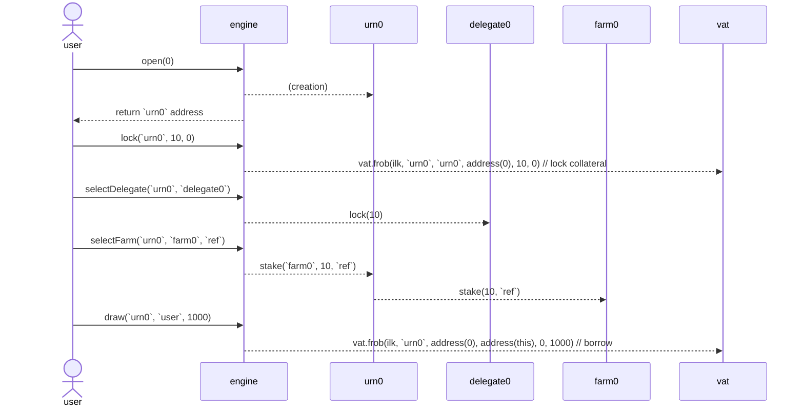

# Sagittarius Lockstake Engine

A technical description of the components of the Sagittarius LockStake Engine (SLE).


## 1. LockstakeEngine

The LockstakeEngine is the main contract in the set of contracts that implement and support the SLE. On a high level, it supports locking MKR in the contract, and using it to:
* Vote through a delegate contract.
* Farm NST or SDAO tokens.
* Borrow NST through a vault.

When withdrawing back the MKR the user has to pay an exit fee.

There is also support for locking and freeing NGT instead of MKR.

**System Attributes:**

* A single user address can open multiple positions (each denoted as `urn`).
* Each `urn` relates to zero or one chosen delegate contract, zero or one chosen farm, and one vault.
* MKR cannot be moved outside of an `urn` or between `urn`s without paying the exit fee.
* At any time the user's entire locked MKR amount is either staked or not, and is either delegated or not.
* The entire locked MKR amount is also credited as collateral for the user. However, the user itself decides if and how much NST to borrow, and should be aware of liquidation risk.
* A user can delegate control of an `urn` that it controls to another EOA/contract. This is helpful for supporting manager-type contracts that can be built on top of the engine.
* Once a vault goes into liquidation, it's MKR is undelegated and unstaked. It and can only be re-delegated or re-staked once there are no more auctions for it.

**User Functions:**

* `open(uint256 index)` - Create a new `urn` for the sender. The `index` parameter specifies how many `urn`s have been created so far by the user (should be 0 for the first call). It is used to avoid race conditions.
* `hope(address urn, address usr)` - Allow `usr` to also manage the sender's controlled `urn`.
* `nope(address urn, address usr)` - Disallow `usr` from managing the sender's controlled `urn`.
* `lock(address urn, uint256 wad, uint16 ref)` - Deposit `wad` amount of MKR into the `urn`. This also delegates the MKR to the chosen delegate (if such exists) and stakes it to the chosen farm (if such exists) using the `ref` code.
* `lockNgt(address urn, uint256 ngtWad)` - Deposit `ngtWad` amount of NGT. The NGT is first converted to MKR, which then gets deposited into the `urn`. This also delegates the MKR to the chosen delegate (if such exists) and stakes it to the chosen farm (if such exists) using the `ref` code.
* `free(address urn, address to, uint256 wad)` - Withdraw `wad` amount of MKR from the `urn` to the `to` address (which will receive it minus the exit fee). This will undelegate the requested amount of MKR (if delegation is done) and unstake it (if staking is done). It will require the user to pay down debt beforehand if needed.
* `freeNgt(address urn, address to, uint256 ngtWad)` - Withdraw `ngtWad` amount of NGT to the `to` address. In practice, a proportional amount of MKR is first freed from the `urn` (minus the exit fee), then gets converted to NGT and sent out. This will undelegate the MKR (if delegation is done) and unstake it (if staking is done). It will require the user to pay down debt beforehand if needed.
* `freeNoFee(address urn, address to, uint256 wad)` - Withdraw `wad` amount of MKR from the `urn` to the `to` address without paying any fee. This will undelegate the requested amount of MKR (if delegation is done) and unstake it (if staking is done). It will require the user to pay down debt beforehand if needed. This function can only be called by an address which was both authorized on the contract by governance and for which the urn owner has called `hope` for. It is useful for implementing a migration contract that will move the funds to another engine contract (if ever needed).
* `selectDelegate(address urn, address delegate)` - Choose which delegate contract to delegate the `urn`'s entire MKR amount to. In case it is `address(0)` the MKR will stay (or become) undelegated.
* `selectFarm(address urn, address farm, uint16 ref)` - Select which farm (from the whitelisted ones) to stake the `urn`'s MKR to (along with the `ref` code). In case it is `address(0)` the MKR will stay (or become) unstaked.
* `draw(address urn, address to, uint256 wad)` - Generate `wad` amount of NST using the `urn`’s MKR as collateral and send it to the `to` address.
* `wipe(address urn, uint256 wad)` - Repay `wad` amount of NST backed by the `urn`’s MKR.
* `getReward(address urn, address farm, address to)` - Claim the reward generated from a farm on behalf of the `urn` and send it to the specified `to` address.
* `multicall(bytes[] calldata data)` - Batch multiple methods in a single call to the contract.

**Sequence Diagram:**

Below is a diagram of a typical user sequence for winding up an SLE position.

For simplicity it does not include all external messages, internal operations or token interactions.



**Multicall:**

LockstakeEngine implements a [multicall](https://github.com/makerdao/lockstake/blob/ecb993c79e92ee20c79a41b7f28b56f71c584cb9/src/Multicall.sol#L9) function, which allows batching several function calls.

For example, a typical flow for a user (or an app/front-end) would be to first query `index=usrAmts(usr)` and `urn=getUrn(usr, index)` off-chain to retrieve the expected `index` and `urn` address, then use these to perform a multicall sequence that includes `open`, `selectFarm`, `lock` and `stake`.

This way, locking and farm-staking can be achieved in only 2 transactions (including the token approval).

Note that since the `index` is first fetched off-chain and there is no support for passing return values between batched calls, there could be race conditions for calling `open`. For example,`open` can be called twice by the user (e.g. in two different contexts) with the second `usrAmts` query happening before the first `open` call has been confirmed. This would lead to both calls using the same `urn` for `selectFarm`, `lock` and `stake`.

To mitigate this, the `index` parameter for `open` is used to make sure the multicall transaction creates the intended `urn`.

**Minimal Proxies:**

Upon calling `open`, an `urn` contract is deployed for each position. The `urn` contracts are controlled by the engine and represent each user position for farming, delegation and borrowing. This deployment process uses the [ERC-1167 minimal proxy pattern](https://eips.ethereum.org/EIPS/eip-1167), which helps reduce the `open` gas consumption by around 70%.

**Liquidation Callbacks:**

The following functions are called from the LockstakeClipper (see below) throughout the liquidation process.

* `onKick(address urn, uint256 wad)` - Undelegate and unstake the entire `urn`'s MKR amount. Also burn the liquidated amount of staking token (`stkMkr`).
* `onTake(address urn, address who, uint256 wad)` - Transfer MKR to the liquidation auction buyer.
* `onRemove(address urn, uint256 sold, uint256 left)` - Burn a proportional amount of the MKR which was bought in the auction and return the rest to the `urn`.

**Configurable Parameters:**

* `farms` - Whitelisted set of farms to choose from.
* `jug` - The Dai lending rate calculation module.


Up to date implementation: https://github.com/makerdao/lockstake/commit/bbe569d6b8a5a6944592109b9a8a94c1092be117

## 2. LockstakeClipper

A modified version of the Liquidations 2.0 Clipper contract, which uses specific callbacks to the LockstakeEngine on certain events. This follows the same paradigm which was introduced in [proxy-manager-clipper](https://github.com/makerdao/proxy-manager-clipper/blob/67b7b5661c01bb09d771803a2be48f0455cd3bd3/src/ProxyManagerClipper.sol) (used for [dss-crop-join](https://github.com/makerdao/dss-crop-join)).

Specifically, the LockstakeEngine is called upon a beginning of an auction (`onKick`), a sell of collateral (`onTake`), and when the auction is concluded (`onRemove`).

The SLE liquidation process differs from the usual liquidations by the fact that it sends the taker callee the collateral (MKR) in the form of ERC20 tokens and not `vat.gem`.

**Exit Fee on Liquidation**

For a liquidated position the relative exit fee is burned from the MKR (collateral) leftovers upon completion of the auction. To ensure enough MKR is left, and also prevent incentives for self-liquidation, the ilk's liquidation ratio (`mat`) must be set high enough. We calculate below the minimal `mat` (while ignoring parameters resolution for simplicity):

To be able to liquidate we need the vault to be under-collateralized. The point where that happens is:
`① ink * price / mat = debt`

The debt to be auctioned is enlarged (by the penalty) to `debt * chop` (where typically `chop` is 113%). If we assume the auction selling is at market price and that the market price didn't move since the auction trigger, then the amount of collateral sold is:
`debt * chop / price`

Since we need to make sure that only up to `(1-fee)` of the total collateral is sold (where `fee` will typically be 15%), we require:
`② debt * chop / price < (1-fee) * ink`

From ① and ② we get the requirement on `mat`:
`mat > chop / (1 - fee)`

For the mentioned examples of `chop` and `fee` we get:
`mat > 1.13 / 0.85 ~= 133%`


**Configurable Parameters (similar to a regular Clipper):**

* `dog` - Liquidation module.
* `vow` - Recipient of DAI raised in auctions.
* `spotter` - Collateral price module.
* `calc` - Current price calculator.
* `buf` - Multiplicative factor to increase starting price.
* `tail` - Time elapsed before auction reset.
* `cusp` - Percentage drop before auction reset.
* `chip` - Percentage of tab to suck from vow to incentivize keepers.
* `tip` - Flat fee to suck from vow to incentivize keepers.
* `chost` - Cache the ilk dust times the ilk chop to prevent excessive SLOADs.

Up to date implementation: https://github.com/makerdao/lockstake/commit/bbe569d6b8a5a6944592109b9a8a94c1092be117

## 3. Vote Delegation
### 3.a. VoteDelegate

The SLE integrates with the current [VoteDelegate](https://github.com/makerdao/vote-delegate/blob/c2345b78376d5b0bb24749a97f82fe9171b53394/src/VoteDelegate.sol) contracts almost as is. However, there are two changes done:
* In order to support long-term locking the delegate's expiration functionality needs to be removed.
* In order to protect against an attack vector of delaying liquidations or blocking freeing of MKR, an on-demand window where locking MKR is blocked is introduced. The need for this stems from the Chief's flash loan protection, which doesn't allow to free MKR from a delegate in case MKR locking was already done in the same block.

### 3.b. VoteDelegateFactory

Since the VoteDelegate code is being modified (as described above), the factory also needs to be re-deployed.

Note that it is important for the SLE to only allow using VoteDelegate contracts from the factory, so it can be made sure that liquidations can not be blocked.

Up to date implementation: https://github.com/makerdao/vote-delegate/tree/v2/src

## 4. Keepers Support

In general participating in MKR liquidations should be pretty straightforward using the existing on-chain liquidity. However there is a small caveat:

Current Makerdao ecosystem keepers expect receiving collateral in the form of `vat.gem` (usually to a keeper arbitrage callee contract), which they then need to `exit` to ERC20 from. However the SLE liquidation mechanism sends the MKR directly in the form of ERC20, which requires a slight change in the keepers mode of operation.

For example, keepers using the Maker supplied [exchange-callee for Uniswap V2](https://github.com/makerdao/exchange-callees/blob/3b080ecd4169fe09a59be51e2f85ddcea3242461/src/UniswapV2Callee.sol#L109) would need to use a version that gets the `gem` instead of the `gemJoin` and does not call `gemJoin.exit`.

## 5. Splitter

The Splitter contract is in charge of distributing the Surplus Buffer funds on each `vow.flap` to the Smart Burn Engine (SBE) and the SLE's NST farm. The total amount sent each time is `vow.bump`.

To accomplish this, it exposes a `kick` operation to be triggered periodically. Its logic withdraws DAI from the `vow` and splits it in two parts. The first part (`burn`) is sent to the underlying `flapper` contract to be processed by the SBE. The second part (`WAD - burn`) is distributed as reward to a `farm` contract. Note that`burn == 1 WAD` indicates funneling 100% of the DAI to the SBE without sending any rewards to the farm.

When sending DAI to the farm, the splitter also calls `farm.notifyRewardAmount` to update the farm contract on the new rewards distribution. This resets the farming distribution period to the governance configured duration and sets the rewards rate according to the sent reward amount and rewards leftovers from the previous distribution (in case there are any).

The Splitter implements rate-limiting using a `hop` parameter.

**Configurable Parameters:**
* `flapper` - The underlying burner strategy (e.g. the address of `FlapperUniV2SwapOnly`).
* `burn` - The percentage of the `vow.bump` to be moved to the underlying `flapper`. For example, a value of 0.70 \* `WAD` corresponds to a funneling 70% of the DAI to the burn engine.
* `hop` - Minimal time between kicks.

Up to date implementation: https://github.com/makerdao/dss-flappers/commit/ce7978eaba86c8110d9cf5c04aa50f8f7af83197

## 6. StakingRewards

The SLE uses a Maker modified [version](https://github.com/makerdao/endgame-toolkit/blob/master/README.md#stakingrewards) of the Synthetix Staking Reward as the farm for distributing NST to stakers.

For compatibility with the SBE, the assumption is that the duration of each farming distribution (`farm.rewardsDuration`) is similar to the flapper's cooldown period (`flap.hop`). This in practice divides the overall farming reward distribution to a set of smaller non overlapping distributions. It also allows for periods where there is no distribution at all.

The StakingRewards contract `setRewardsDuration` function was modified to enable governance to change the farming distribution duration even if the previous distribution has not finished. This now supports changing it simultaneously with the SBE cooldown period (through a governance spell).

**Configurable Parameters:**
* `rewardsDistribution` - The address which is allowed to start a rewards distribution. Will be set to the splitter.
* `rewardsDuration` - The amount of seconds each distribution should take.

Up to date implementation: https://github.com/makerdao/endgame-toolkit/commit/1a857ee888d859b3b08e52ee12f721d1f3ce80c6

## 7. Flappers

The system supports the following burn engine implementations and can switch between them through a governance spell.

### 7.a. FlapperUniV2

Exposes an `exec` operation to be triggered periodically. Its logic withdraws DAI from the `vow` and buys `gem` tokens on Uniswap v2. The acquired tokens, along with a proportional amount of DAI (saved from the initial withdrawal) are deposited back into the liquidity pool. Finally, the minted LP tokens are sent to a predefined `receiver` address.

Note that as opposed to the first version of FlapperUniV2, the SLE aligned version was changed so that the `lot` parameter it receives on `kick` indicates the total amount the flapper should consume (and not just the amount to sell).

The calculations of how much DAI to sell out of `lot` so that the exact proportion of deposit amount remains afterwards can be seen in the code [comments](https://github.com/makerdao/dss-flappers/blob/78f2ec664ba5ad6de45195ff6fdd68771145a56a/src/FlapperUniV2.sol#L150).

**Configurable Parameters:**
* `pip` - A reference price oracle, used for bounding the exchange rate of the swap.
* `want` - Relative multiplier of the reference price to insist on in the swap. For example, a value of 0.98 * `WAD` allows for a 2% worse price than the reference.

Up to date implementation: https://github.com/makerdao/dss-flappers/commit/ce7978eaba86c8110d9cf5c04aa50f8f7af83197

### 7.b. FlapperUniV2SwapOnly

Exposes an `exec` operation to be triggered periodically. Its logic withdraws DAI from the `vow` and buys `gem` tokens on Uniswap v2. The acquired tokens are sent to a predefined `receiver` address.

**Configurable Parameters:**
* `pip` - A reference price oracle, used for bounding the exchange rate of the swap.
* `want` - Relative multiplier of the reference price to insist on in the swap. For example, a value of 0.98 * `WAD` allows for a 2% worse price than the reference.

Up to date implementation: https://github.com/makerdao/dss-flappers/commit/ce7978eaba86c8110d9cf5c04aa50f8f7af83197


## 8. Maximal Debt Ceiling Instant Access Module
### 8.a. LockstakeMaxAutoLine

An instant access module which adjusts the SLE's maximal debt ceiling (`autoLine[ilk].line`) according to the protocol owned liquidity, and also adjusts the rate (`jug[ilk].duty`) to incentivise wind-down in case the maximal debt ceiling is exceeded.

#### Maximal Debt ceiling

The maximal debt ceiling is determined based on the surplus and reserves owned by the Maker Protocol. It is adjusted automatically through an algorithm, and set in the regular DC-IAM (`autoLine`).

For the first version (before the SubDaos launch) this contract permissionlessly sets the max debt ceiling of the autoline to:
`100% * the Surplus Buffer + 80% * protocol DAI deposited in Uniswap`

Note that the above amount of Uniswap held DAI is equivalent to 40% of Elixir value.

The Surplus Buffer amount of DAI can be fetched easily (`vat.dai(vow) - vat.sin(vow)`). However, the Uniswap owned DAI calculation needs to be resistent to manipulation. For that we use the fair token prices, as in the [Uniswap V2 LP oracle](https://github.com/makerdao/univ2-lp-oracle/blob/874a59d74d847909cc4a31f0d38ee6b020f6525f/src/UNIV2LPOracle.sol#L22).

#### Rate

Upon setting a new max debt ceiling, the rate (`jug[ilk].duty`) is adjusted either to its regular value, or to a wind-down value (expected to incentivize debt repayment).

**Configurable Parameters:**
* `duty` - Regular rate.
* `windDownDuty` - Repayment incetivizing rate.
* `lpFactor` - Percentage of Elixir value to take into account in the maximal debt ceiling calculation (planned as 40%).

Up to date implementation:
https://github.com/makerdao/lockstake/commit/f837c5ef3967654b313b2dbb28d4b8cc09c25094

### 8.b. Cron Keeper Job

For triggering the LockstakeMaxAutoLine a keeper job contract will be added. It should hold sensitivity thresholds, similarly to how the current autoline job [does](https://github.com/makerdao/dss-cron/blob/ae1300023b5db04851b1e8f926e5b7a59ffd18b0/src/AutoLineJob.sol#L47).

## 9. Sticky Oracle
### 9.a. StickyOracle 

The MKR oracle for the SLE vaults has sticky upwards price movement. It works by operating both on a market price measured from the MKR underlying oracle, and a Sticky Price. The Sticky Price is what is actually used for calculating the Liquidation Ratio.

Whenever the real price is below the Sticky Price, the Sticky Price instantly adjusts down to be equal to the real price.

When the real price is above the Sticky Price, the Sticky Price adjusts upwards at a throttled rate (for example, a rate of at most 5% per month).

To achieve this behaviour the Sticky oracle always returns the minimum of the underlying oracle (`pip.read()`) and a `cap` storage variable.

The `cap` is stored daily (upon `poke` operations). It is calculated from the product of a TWAP calculation and a `slope` parameter (configured to only allow the desired growth rate). The TWAP itself is based on daily samples of the sticky price (performed during `poke` as well), and has a configureable window of days.

In case a `poke` operation was not done on the current day, or in case a previous sample is missing for the TWAP calculation on `poke`, the previous day's `cap` will be used.

An `init` function is provided to initiate the oracle and for governance to artificially set the sticky price samples of a certain amount of days in the past (in case it desires). The setting of past samples can enhance the current `cap` calculation, as these samples will not be missing from the TWAP computation.

**Example:**

Below is a simple example of the sticky oracle mechanics for a TWAP window of 3 days, and an effective slope of 105%. It assumes there has been an initiation period of 3 days (d0-d3) for a price of 1000.

On each day `TWAP(sticky)` is calculated based on the `sticky samples` of the last 3 days (`TWAP window`). Then `cap` is calculated by multiplying `TWAP(sticky)` by 1.05. Finally, the current day's sticky sample is updated as `min(cap, MKR oracle)`.

We can see that although the MKR oracle price is fixed at 1080, the sticky price grows at a controlled rate since it is bounded by the `cap`. Once the `cap` outgrows the MKR oracle price, the MKR oracle price is used as the sticky price.

```

days:           d0 ------- d1 ------- d2 ------- d3 ------- d4 ------- d5

MKR oracle:     -------------------------------- 1080 ----- 1080 ----- 1080

TWAP window:    -------------------------------- d0->d3 --- d1->d4 --- d2->d5

TWAP(sticky):   -------------------------------- 1000 ----- 1016 ----- 1038

cap:            -------------------------------- 1050 ----- 1066 ----- 1089

sticky samples: 1000 ----- 1000 ----- 1000 ----- 1050 ----- 1066 ----- 1080


```

**Configurable Parameters:**

* `buds` - Whitelisted oracle readers.
* `slope` - Maximum allowable price growth factor from center of * TWAP window to now (in `RAY` such that `slope = (1 + {max growth rate}) * RAY`).
* `lo` - How many days ago should the TWAP window start (exclusive), should be more than `hi`.
* `hi` - How many days ago should the TWAP window end (inclusive), should be less than `lo` and more than 0.

Up to date implementation: https://github.com/makerdao/lockstake/commit/1ed6d987b3ed4bdfa378f3f35f18a01a064a2a43

### 9.b. Cron Keeper Job

For performing `poke` on the Sticky Oracle a simple keeper job contract will be added. Since the `poke` will revert if it was already performed on that certain day, the job can return a workable status whenever it does not revert.


## 10. Deployment Scripts

## 11. Formal Verification
    
## General Notes
* In many of the modules, such as the splitter and the flappers, NST can replace DAI. This will usually require a deployment of the contract with NstJoin as a replacement of the DaiJoin address.
* The SLE assumes that the ESM threshold is set large enough prior to its deployment, so Emergency Shutdown can never be called.


