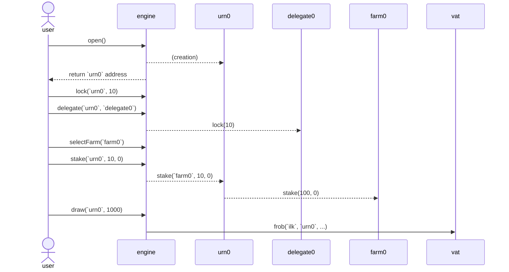
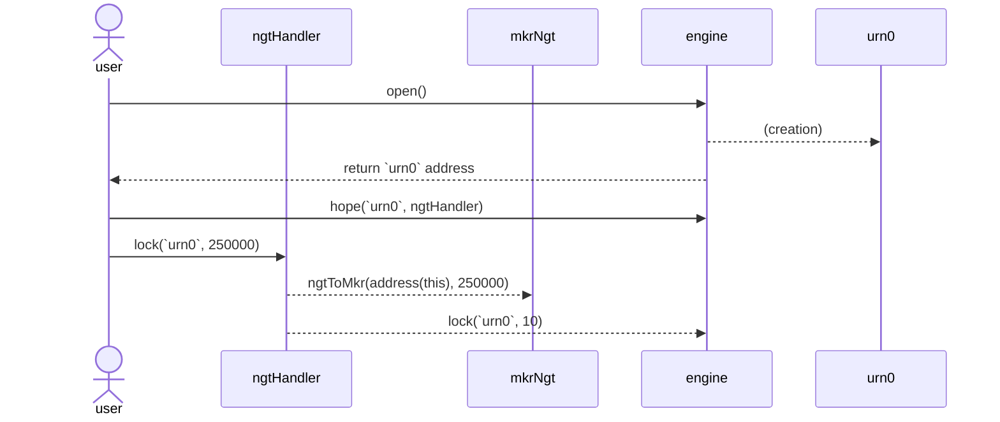

# Sagittarius Lockstake Engine

A technical description of the components of the Sagittarius LockStake Engine (SLE).


## 1. LockstakeEngine

The LockstakeEngine is the main contract in the set of contracts that implement and support the SLE. On a high level, it supports locking MKR in the contract, and using it to:
* Vote through a delegate contract.
* Farm NST or SDAO tokens.
* Borrow NST through a vault.

When withdrawing back the MKR the user has to pay an exit fee.

**System Attributes:**

* A single user address can open multiple positions (each denoted as `urn`).
* Each `urn` relates to zero or one chosen delegate contract, zero or one chosen farm, and one vault.
* MKR cannot be moved outside of an `urn` or between `urn`s without paying the exit fee.
* In case a delegate contract is chosen, the user's entire locked MKR amount is delegated.
* In case a farm is chosen, the user can choose how much of its MKR credit to stake for farming.
* The entire locked MKR amount is also credited as collateral for the user, however the user itself decides if and how much NST to borrow.
* A user can delegate control of an `urn` that it controls to another EOA/contract.

**User Functions:**

* `open()` - Create a new `urn` for the sender.
* `hope(address urn, address usr)` - Allow `usr` to also manage the sender's controlled `urn`.
* `nope(address urn, address usr)` - Disallow `usr` from managing the sender's controlled `urn`.
* `lock(address urn, uint256 wad)` - Deposit `wad` amount of MKR into the `urn`. This also delegates the newly deposited MKR to the chosen delegate (if such exists).
* `free(address urn, address to, uint256 wad)` - Withdraw `wad` amount of MKR from the `urn` to the `to` address (which will receive it minus the exit fee). This will undelegate the requested amount of MKR, but will require the user to withdraw from the farm and/or pay down debt beforehand if needed.
* `delegate(address urn, address delegate_)` - Choose which delegate contract to delegate the `urn`'s entire MKR amount to. In case it is `address(0)` the MKR will stay (or become) undelegate.
* `draw(address urn, uint256 wad)` - Generate `wad` amount of NST using `urn`’s MKR as collateral
* `wipe(address urn, uint256 wad)` - Repay `wad` amount of NST backed by the `urn`’s MKR.
* `selectFarm(address urn, address farm)` - Select which farm (from the whitelisted ones) the `urn` will use for depositing its MKR credit (denoted as `stkMKR`).
* `stake(address urn, uint256 wad, uint16 ref)` - Deposit `wad` amount of `stkMKR` in the previously selected farm.
* `withdraw(address urn, uint256 wad)` - Withdraw `wad` amount of `stkMKR` previously deposited in the selected farm.
* `getReward(address urn, address farm, address to)` - Claim the reward generated `urn`'s selected farm and send it to the specified `to` address.

**Sequence Diagram:**

Below is a diagram of a typical user sequence for winding up an SLE position.

For simplicity it does not include all external messages, internal operations or token interactions.



**Liquidation Callbacks:**

The following functions are called from the LockstakeClipper (see below) throughout the liquidation process.

* `onKick(address urn, uint256 wad)` - Withdraw `wad` amount of `stkGov` from the chosen farm and undelegate the same amount of MKR from the chosen `urn`'s delegate. The MKR stays in the current contract until it is taken or returned as leftovers to the `urn`.
* `onTake(address urn, address who, uint256 wad)` - Transfer MKR to the liquidation auction buyer.
* `onTakeLeftovers(address urn, uint256 tot, uint256 left)` - Burn a proportional amount of the MKR which was bought in the auction and return the rest to the `urn`. The returned amount is redelegated (but not restaked in the farm).
* `onYank(address urn, uint256 wad)` - Burns the auction's MKR (in case of an auction cancellation).


**Configurable Parameters:**

* `farms` - Whitelisted set of farms to choose from.
* `jug` - The Dai lending rate calculation module.

**TODO**: is exit fee configurable?

Up to date implementation: https://github.com/makerdao/lockstake/commit/fae51fb82c518e1b0cbb238c1a257b2feeaf9982

## 2. LockstakeClipper

A modified version of the Liqidations 2.0 Clipper contract, which uses specific callbacks to the LockstakeEngine on certain events. This follows the same paradigm which was introduced in [proxy-manager-clipper](https://github.com/makerdao/proxy-manager-clipper/blob/67b7b5661c01bb09d771803a2be48f0455cd3bd3/src/ProxyManagerClipper.sol) (used for [dss-crop-join](https://github.com/makerdao/dss-crop-join)).

Specifically, the LockstakeEngine is called upon a beginning of an auction (`onKick`), a sell of collateral (`onTake`), when the auction is concluded and collateral leftover should be returned to the vault owner (`onTakeLeftovers`), and upon auction cancellation (`onYank`).

The SLE liquidation process differs from the usual liquidations by the fact that it sends the taker callee the collateral (MKR) in the form of ERC20 tokens and not `vat.gem`.

**Configurable Parameters (similar to a regular Clipper):**

* `dog` - Liquidation module.
* `vow` - Recipient of DAI raised in auctions.
* `spotter` - Collateral price module.
* `calc` - Current price calculator.
* `buf` - Multiplicative factor to increase starting price.
* `tail` - Time elapsed before auction reset.
* `cusp` - Percentage drop before auction reset.
* `chip` - Percentage of tab to suck from vow to incentivize keepers.
* `tip` - Flat fee to suck from vow to incentivize keepers.
* `chost` - Cache the ilk dust times the ilk chop to prevent excessive SLOADs.

Up to date implementation: https://github.com/makerdao/lockstake/commit/fae51fb82c518e1b0cbb238c1a257b2feeaf9982

## 3. LockstakeNGTHandler

As mentioned the LockstakeEngine operates with MKR natively, and is not aware of the existence of NGT. In order to be able to use NGT as a source for LockstakeEngine, a wrapper is created that does the proper conversions on `lock` and `free`. The rest of the LockstakeEngine functions (such as `delegate`, `stake`, etc..) will be accessed directly through the LockstakeEngine contract.

Note that the LockstakeNGTHandler wrapper does not have any special permission in the system, and there are other options to do this (as with DSProxy and ProxyActions). Therefore, advanced users can achieve the same goal also without it. Also, it is technically possible to enter the system using NGT through LockstakeNGTHandler, but exit to MKR without it.

In order to lock NGT through the LockstakeNGTHandler, a user has to:

* `open` an `urn` regularly through the LockstakeEngine.
* `hope` the LockstakeNGTHandler address using the `urn` on the LockstakeEngine.

Then the user can `lock` NGT through the LockstakeNGTHandler (after approving it on that token contract of course).

**User Functions:**
* `lock(urn, ngtWad)` - lock `wad` amount of NGT in the LockstakeEngine's `urn`.
* `free(urn, ngtWad)` - free `wad` amount of NGT (minus the exit fee) from the LockstakeEngine's `urn`.

**Sequence Diagram:**

Below is a diagram of a typical user sequence for winding up an SLE position, up untill the lock phase, through the LockstakeNGTHandler.

For simplicity it does not include all external messages, internal operations or token interactions. It assumes a 1:25000 conversion rate.



Implementation: **TODO**.

## 4. Vote Delegation
### 5.a. VoteDelegate

The SLE integrates with the current [VoteDelegate](https://github.com/makerdao/vote-delegate/blob/c2345b78376d5b0bb24749a97f82fe9171b53394/src/VoteDelegate.sol) contracts almost as is. However, in order to support long-term locking the delegates expiration functionality needs to be removed.

Implementation: **TODO**.

### 5.b. VoteDelegateFactory

Since the VoteDelegate code is being modified (as described above), the factory also needs to be re-deployed.

Note that it is important for the SLE to only allow using VoteDelegate contracts from the factory, so it can be made sure that liquidations can not be blocked.

Up to date implementation: https://github.com/makerdao/vote-delegate/blob/c2345b78376d5b0bb24749a97f82fe9171b53394/src/VoteDelegateFactory.sol

## 5. Keepers Support

In general participating in MKR liquidations should be pretty straightforward using the existing on-chain liquidity. However there is a small caveat:

Current Makerdao ecosystem keepers expect receiving collateral in the form of `vat.gem` (ususally to a keeper arbitrage callee contract), which they then need to `exit` to ERC20 from. However the SLE liquidation mechanism sends the MKR directly in the form of ERC20, which requires a slight change in the keepers mode of operation.

For example, keepers using the Maker supplied [exchange-callee for Uniswap V2](https://github.com/makerdao/exchange-callees/blob/3b080ecd4169fe09a59be51e2f85ddcea3242461/src/UniswapV2Callee.sol#L109) would need to use a version that gets the `gem` instead of the `gemJoin` and does not call `gemJoin.exit`.

Implementation of exchange callee modifications - **TODO**

## 6. Splitter

The Splitter contract is in charge of distributing the Surplus Buffer funds on each `vow.flap` to the Smart Burn Engine (SBE) and the SLE farm. The total amount sent each time is `vow.bump`.

To accomplish this, it exposes a `kick` operation to be triggered periodically. Its logic withdraws DAI from the `vow` and splits it in two parts. The first part (`burn`) is sent to the underlying `flapper` contract to be processed by the SBE. The second part (`WAD - burn`) is distributed as reward to a `farm` contract. Note that`burn == 1 WAD` indicates funneling 100% of the DAI to the SBE without sending any rewards to the farm.

When sending DAI to the farm, the splitter also calls `farm.notifyRewardAmount` to update the farm contract on the new rewards distribution. This resets the farming distribution period to the governance configured duration and sets the rewards rate according to the sent reward amount and rewards leftovers from the previous distribution (in case there are any).

The Splitter relies on the SBE for rate-limiting, so each distribution will only succeed if the call to `flapper.kick` does not revert. In other words, the `splitter.kick` cadence is determined by `flapper.hop`.

**Configurable Parameters:**
* `flapper` - The underlying burner strategy (e.g. the address of `FlapperUniV2SwapOnly`).
* `burn` - The percentage of the `vow.bump` to be moved to the underlying `flapper`. For example, a value of 0.70 \* `WAD` corresponds to a funneling 70% of the DAI to the burn engine.

Up to date implementation: https://github.com/makerdao/dss-flappers/commit/6f73645f020ed9bf82733b1de595537c137d719b

## 7. StakingRewards

The SLE uses a Maker modified [version](https://github.com/makerdao/endgame-toolkit/blob/master/README.md#stakingrewards) of the Synthetix Staking Reward as the farm for distributing NST to stakers.

For compatibility with the SBE, the assumption is that the duration of each farming distribution (`farm.duration`) is similar to the flapper's cooldown period (`flap.hop`). This in practice divides the overall farming reward distribution to a set of smaller non overlapping distributions. It also allows for periods where there is no distribution at all.

The StakingRewards contract `setRewardsDuration` function was modified to enable governance to change the farming distribution duration even if the previous distribution has not finished. This now supports changing it simultaneously with the SBE cooldown period (through a governance spell).

**Configurable Parameters:**
* `rewardsDistribution` - The address which is allowed to start a rewards distribution. Will be set to the splitter.
* `rewardsDuration` - The amount of seconds each distribution should take.

Up to date implementation: https://github.com/makerdao/endgame-toolkit/commit/1a857ee888d859b3b08e52ee12f721d1f3ce80c6

## 8. Flappers

The system supports the following burn engine implementations and can switch between them through a governance spell.

### 8.a. FlapperUniV2

Exposes a `kick` operation to be triggered periodically. Its logic withdraws DAI from the `vow` and buys `gem` tokens on Uniswap v2. The acquired tokens, along with a proportional amount of DAI (saved from the initial withdrawal) are deposited back into the liquidity pool. Finally, the minted LP tokens are sent to a predefined `receiver` address.

Note that as opposed to the first version of FlapperUniV2, the SLE aligned version was changed so that the `lot` parameter it receives on `kick` indicates the total amount the flapper should consume (and not just the amount to sell).

The calculations of how much DAI to sell out of `lot` so that the exact proportion of deposit amount remains afterwards can be seen in the code [comments](https://github.com/makerdao/dss-flappers/blob/78f2ec664ba5ad6de45195ff6fdd68771145a56a/src/FlapperUniV2.sol#L150).

**Configurable Parameters:**
* `hop` - Minimum seconds interval between kicks.
* `pip` - A reference price oracle, used for bounding the exchange rate of the swap.
* `want` - Relative multiplier of the reference price to insist on in the swap. For example, a value of 0.98 * `WAD` allows for a 2% worse price than the reference.

Up to date implementation: https://github.com/makerdao/dss-flappers/commit/78f2ec664ba5ad6de45195ff6fdd68771145a56a

### 8.b. FlapperUniV2SwapOnly

Exposes a `kick` operation to be triggered periodically. Its logic withdraws DAI from the `vow` and buys `gem` tokens on Uniswap v2. The acquired tokens are sent to a predefined `receiver` address.

**Configurable Parameters:**
* `hop` - Minimum seconds interval between kicks.
* `pip` - A reference price oracle, used for bounding the exchange rate of the swap.
* `want` - Relative multiplier of the reference price to insist on in the swap. For example, a value of 0.98 * `WAD` allows for a 2% worse price than the reference.

Up to date implementation: https://github.com/makerdao/dss-flappers/commit/78f2ec664ba5ad6de45195ff6fdd68771145a56a

## 9. Sticky Oracle
### 9.a. StickyOracle 

The MKR oracle for the SLE vaults has sticky upwards price movement. It works by operating both on a market price measured from the MKR underlying oracle, and a Sticky Price. The Sticky Price is what is actually used for calculating the Liquidation Ratio.

Whenever the real price is below the Sticky Price, the Sticky Price instantly adjusts down to be equal to the real price.

When the real price is above the Sticky Price, the Sticky Price adjusts upwards at a throttled rate (for example, a rate of at most 5% per month).

To achieve this behaviour the Sticky oracle always returns the minimum of the underlying oracle (`pip.read()`) and a `cap` storage variable.

The `cap` is stored daily (upon `poke` operations). It is calculated from the product of a TWAP calculation and a `slope` parameter (configured to only allow the desired growth rate). The TWAP itself is based on daily samples of the sticky price (performed during `poke` as well), and has a configureable window of days.

In case a `poke` operation was not done on the current day, or in case a previous sample is missing for the TWAP calculation on `poke`, the previous day's `cap` will be used.

An `init` function is provided to initiate the oracle and for governance to artificially set the sticky price samples of a certain amount of days in the past (in case it desires). The setting of past samples can enhance the current `cap` calculation, as these samples will not be missing from the TWAP computation.

**Example:**

Below is a simple example of the sticky oracle mechanics for a TWAP window of 3 days, and an effective slope of 105%. It assumes there has been an initiation period of 3 days (d0-d3) for a price of 1000.

On each day `TWAP(sticky)` is calculated based on the `sticky samples` of the last 3 days (`TWAP window`). Then `cap` is calculated by multiplying `TWAP(sticky)` by 1.05. Finally, the current day's sticky sample is updated as `min(cap, MKR oracle)`.

We can see that although the MKR oracle price is fixed at 1080, the sticky price grows at a controlled rate since it is bounded by the `cap`. Once the `cap` outgrows the MKR oracle price, the MKR oracle price is used as the sticky price.

```

days:           d0 -------- d1 -------- d2 -------- d3 -------- d4 -------- d5

MKR oracle:     ----------------------------------- 1080 ------ 1080 ------ 1080

TWAP window:    ----------------------------------- d0->d3 ---- d1->d4 ---- d2->d5

TWAP(sticky):   ----------------------------------- 1000 ------ 1016 ------ 1038

cap:            ----------------------------------- 1050 ------ 1066 ------ 1089

sticky samples: 1000 ------ 1000 ------ 1000 ------ 1050 ------ 1066 ------ 1080


```

**Configurable Parameters:**

* `buds` - Whitelisted oracle readers.
* `slope` - Maximum allowable price growth factor from center of * TWAP window to now (in `RAY` such that `slope = (1 + {max growth rate}) * RAY`).
* `lo` - How many days ago should the TWAP window start (exclusive), should be more than `hi`.
* `hi` - How many days ago should the TWAP window end (inclusive), should be less than `lo` and more than 0.

Up to date implementation: https://github.com/makerdao/lockstake/commit/1ed6d987b3ed4bdfa378f3f35f18a01a064a2a43

### 9.b. Cron Keeper Job

For performing `poke` on the Sticky Oracle a simple keeper job contract will be added. Since the `poke` will revert if it was already performed on that certain day, the job can return a workable status whenever it does not revert.

Implementation - **TODO**

## 10. Debt Ceiling Instant Access Module
### 10.a. DC-IAM-SETTER

The Debt Ceiling of SLE vaults is determined based on the surplus and reserves owned by the Maker Protocol. The total value of the debt ceiling is adjusted automatically through an algorithm.

For the first version (before the SubDaos launch) this contract permissionlessly sets the max debt ceiling of the autoline to:
`100% * the Surplus Buffer + 80% * protocol DAI deposited in Uniswap`

Note that the above amount of uniswap held DAI is equivalent to 40% of Elixir value.

The Surplus Buffer amount of DAI can be fetched easily (`vat.dai(vow) - vat.sin(vow)`). However, the Uniswap owned DAI calculation needs to be resistent to manipulation. For that we can use the [fair token prices](https://github.com/Uniswap/v2-periphery/blob/0335e8f7e1bd1e8d8329fd300aea2ef2f36dd19f/contracts/libraries/UniswapV2LiquidityMathLibrary.sol#L116) (which requires reading the MKR oracle).

Implementation - **TODO**

### 10.b. Cron Keeper Job

For triggering the DC-IAM-SETTER a keeper job contract will be added. It should hold sensitivity thresholds, similarly to how the current autoline job [does](https://github.com/makerdao/dss-cron/blob/ae1300023b5db04851b1e8f926e5b7a59ffd18b0/src/AutoLineJob.sol#L47).

Implementation - **TODO**

## 11. Stability Rate Setter
### 11.a. STABILITY-RATE-SETTER

Under normal circumstances the Stability Fee of the SLE vaults is equal to the Base Rate. However, when the max debt ceiling is exceeded there needs to be a mechanism for incentivizing wind down.

To achieve this, the STABILITY-RATE-SETTER will increase the stability fee when such a situation takes place, and will allow returning to the Base Rate once the max debt ceiling has again been reached.

Implementation - **TODO**

### 11.b. Cron Keeper Job

For triggering the STABILITY-RATE-SETTER a keeper job contract will be added. It should hold sensitivity thresholds, similarly to how the current autoline job [does](https://github.com/makerdao/dss-cron/blob/ae1300023b5db04851b1e8f926e5b7a59ffd18b0/src/AutoLineJob.sol#L47).

Implementation - **TODO**

## 12. Deployment Scripts

Implementation - **TODO**

## 13. Formal Verification

Implementation - **TODO**
    
## General Notes
* In many of the modules, such as the splitter and the flappers, NST can replace DAI. This will usually require a deployment of the contract with NstJoin as a replacement of the DaiJoin address.
* The SLE assumes that the ESM threshold is set large enough prior to its deployment, so Emergency Shutdown can never be called.


